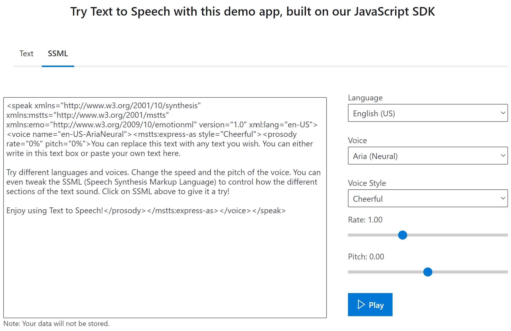

# Customizing this application

There are a bunch of choices if you want to customize this sample app!

## Changing the Spoken Text

If you want to change what words are read out when different hand symbols are recognized, just tweak the JS object [here](https://github.com/lazerwalker/machine-learning-rps/blob/main/src/index.ts#L33-L43). When the machine learning model recognizes on of the symbols listed as keys on the left-hand side, it will trigger neural text-to-speech using the text values on the right-hand side.
The speech will be read by the `en-US-AriaNeural` neural TTS voice, but you can change the voice used [here](https://github.com/lazerwalker/machine-learning-rps/blob/main/src/textToSpeech.ts#L57). For example:

```js
  const map = {
    [ClassificationOption.Rock]: "that's a rock",
    [ClassificationOption.Paper]: "flat hand makes paper",
    [ClassificationOption.Scissors]: "don't run with scissors",
    [ClassificationOption.Lizard]: "lizard",
    [ClassificationOption.Spock]: "like a pinch on the neck from Mr Spock",
    [ClassificationOption.Nothing]: "nothing",
  };
```
 Alternatively, you can provide [SSML](https://docs.microsoft.com/en-us/azure/cognitive-services/speech-service/speech-synthesis-markup?tabs=csharp&WT.mc_id=rpsweb-github-emwalker) to change the voice and other attributes of the speech. You can test out your SSML at the [Neural TTS demo page](https://azure.microsoft.com/en-us/services/cognitive-services/text-to-speech/?WT.mc_id=rpsweb-github-davidsmi#features).

[](https://azure.microsoft.com/en-us/services/cognitive-services/text-to-speech/?WT.mc_id=rpsweb-github-davidsmi#features)

Here are some examples to try for the "paper", "lizard" and "spock" gestures:

```js
  const map = {
    [ClassificationOption.Rock]: 'that\'s a rock',
    [ClassificationOption.Paper]: '<speak xmlns="http://www.w3.org/2001/10/synthesis" xmlns:mstts="http://www.w3.org/2001/mstts" xmlns:emo="http://www.w3.org/2009/10/emotionml" version="1.0" xml:lang="en-US"><voice name="fr-FR-DeniseNeural"><mstts:express-as style="CustomerService"><prosody rate="0%" pitch="0%">voici le papier</prosody></mstts:express-as></voice></speak>',
    [ClassificationOption.Scissors]: 'don\'t run with scissors',
    [ClassificationOption.Lizard]: '<speak xmlns="http://www.w3.org/2001/10/synthesis" xmlns:mstts="http://www.w3.org/2001/mstts" xmlns:emo="http://www.w3.org/2009/10/emotionml" version="1.0" xml:lang="en-US"><voice name="de-DE-KatjaNeural"><mstts:express-as style="General"><prosody rate="0%" pitch="0%">That is a lizard, ja?</prosody></mstts:express-as></voice></speak>',
    [ClassificationOption.Spock]: '<speak xmlns="http://www.w3.org/2001/10/synthesis" xmlns:mstts="http://www.w3.org/2001/mstts" xmlns:emo="http://www.w3.org/2009/10/emotionml" version="1.0" xml:lang="en-US"><voice name="en-US-AriaNeural"><mstts:express-as style="Cheerful"><prosody rate="15%" pitch="10%">like a pinch on the neck from Mr Spock</prosody></mstts:express-as></voice></speak>',
    [ClassificationOption.Nothing]: 'nothing',
  };
  ```

 You can find more [examples of the JavaScript interface to Neural Text-to-Speech here](https://docs.microsoft.com/azure/cognitive-services/speech-service/quickstarts/text-to-speech?pivots=programming-language-javascript&tabs=dotnet%2Clinux%2Cjre%2Cwindowsinstall&WT.mc_id=rpsweb-github-davidsmi).

## Changing the model itself

If you want to swap out the [Custom Vision](https://customvision.ai) hand symbol recognition model for a different one entirely, that's going to take a little more work.

First, you'll need to train a Custom Vision model using one of the "compact" domains.
This you may find this [Custom Vision
workshop](https://github.com/sethjuarez/vision) useful if you haven't trained a
model before, and it also provides a convenient tool for capturing the image data needed to
train the model. 

For starters, you're going to need to export your model from Custom Vision as a TensorFlow.js model. You can drop the exported model right into the `model` folder of your repository, overwriting the existing one.

In this codebase, the main place to look is the [imageDetection.ts file](https://github.com/lazerwalker/machine-learning-rps/blob/main/src/imageDetection.ts), which contains all of that logic.

There are three important things to note here:

1. The way we read in values is hardcoded to match the order returned by our specific model (see: [code](https://github.com/lazerwalker/machine-learning-rps/blob/main/src/imageDetection.ts#L31-L38)). If you have your own TensorFlow.js model, you should make sure the way you're reading this data in matches the order specified in your `labels.txt` file.

2. The bulk of this code ([this bit here](https://github.com/lazerwalker/machine-learning-rps/blob/main/src/imageDetection.ts#L40-L85)) is our own custom logic to clean up some of our noisy model data. If you're pulling in your own model, you'll likely need to hand-tweak the way you're interpreting the results in a similar way. We came up with these manual rules by testing the app with the debug log turned on (press 'd' while the webapp is open to see the raw percentages output by the model). We recommend hooking up your data to the debug infrastructure we already have in place to manually see what your own data looks like. See [this function](https://github.com/lazerwalker/machine-learning-rps/blob/main/src/index.ts#L80-L95) for what that currently looks like, although you may also need to tweak the DOM elements in `index.html` as well.

3. If you adjust the [TypeScript type definitions](https://github.com/lazerwalker/machine-learning-rps/blob/main/src/imageDetection.ts#L3-L21) to match the sort of results your own model generates, this is going to make finding other changes easier. There are a handful of places you will need to modify within `index.ts`, but changing the type definitions here will allow you to largely use the TypeScript compiler to tell you where those changes need to be made.
